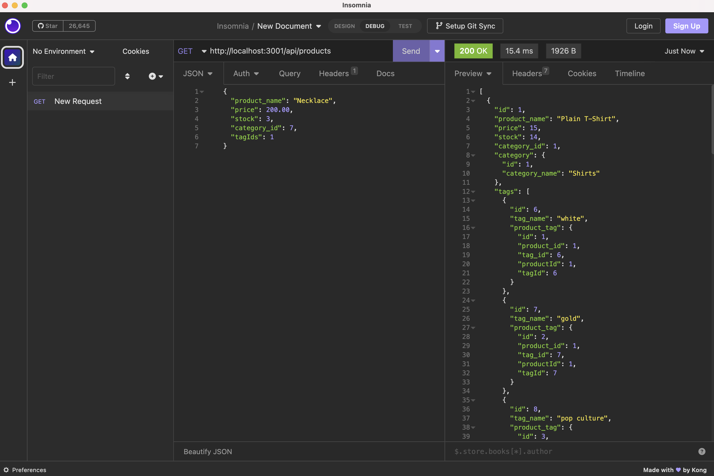
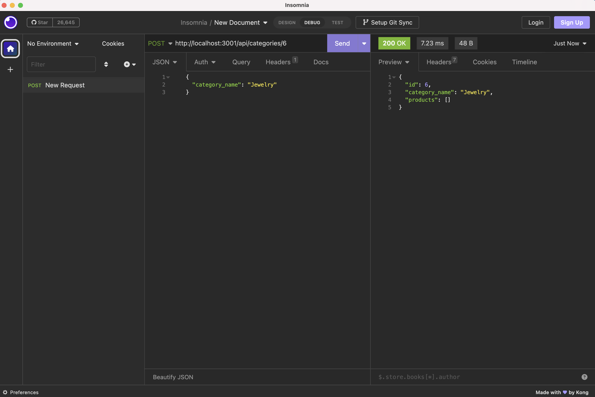

# orm-e-commerce-back-end

  ## Table of Contents
  - [Description](#description)
  - [Installation](#installation)
  - [Useage](#useage)
  - [Testing](#testing)
  - [Collaborators](#collaborators)
  - [Questions](#questions)

  ## Description 
  Built the back end for an e-commerce site using dotenv, Express.js, Mysql2, and Sequelize. Configured an Express.js API to use with Sequelize to interact with a MySql database.

  ## Installation
  Installation of [MySQL 2](https://www.npmjs.com/package/mysql2)
  *  Use ``npm install --save mysql2``

  Installation of [Sequelize](https://www.npmjs.com/package/sequelize)
  * Use ``npm install``

 Installation of [dotenv](https://www.npmjs.com/package/dotenv)
  * Use ``npm install dotenv --save``

  ## Useage 
  First, run ``npm run seed`` to seed data to your database so that you can test the routes using Insomnia. Second, use the command ``npm start`` to run the app on the localhost. 
  
  Watch video of the functionality of the e-commerce back end: [here](https://drive.google.com/file/d/1ckMHR8jC4ZRVqy8G84H3H81AurTi7o_B/view?usp=sharing).

  ## Testing 
  n/a

  ## Collaborators 
  n/a

  ## Questions?

  GitHub: [@RachelWildberger](https://github.com/RachelWildberger)

  Email: rachelwildberger@icloud.com